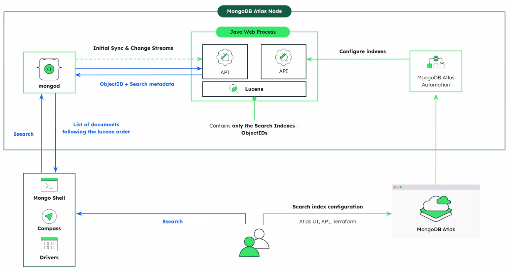
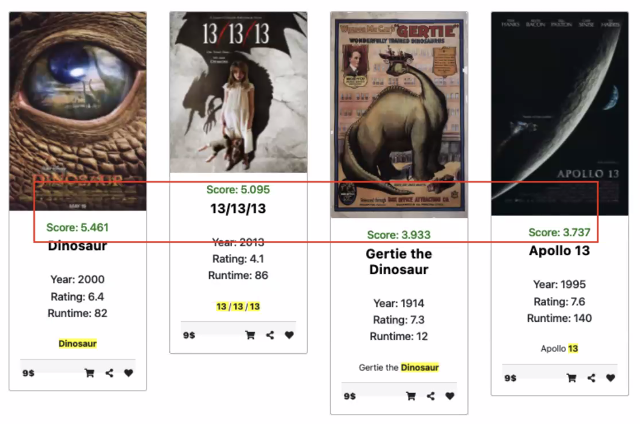
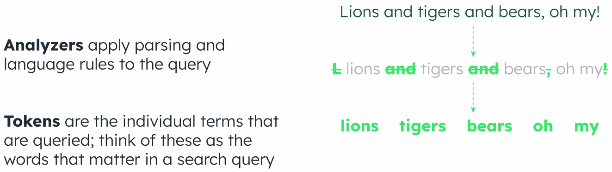

# Atlas

## Atlas search
- Define relevance-based search. Based on apache Lucene.



- Other supported features
  - Support 40* languages
  - Autocomplete
  - Highlighting
  - Fuzzy matching
  - Faceting
  - Multiple data types
    - GeoJSON, dates, ...
  - Synonyms
  
  - Scoring
  


<br>


### Creating an index 
```js
{ 
  "name": "<index-name>", // required
  "analyzer": "<analyzer-for-index>",
  "searchAnalyzer": "<analyzer-for-query>", 
  "mappings": { // required
    "dynamic": <boolean>, 
    "fields": { <field-definition> } 
  }, 
  "analyzers": [ <custom-analyzer> ],
  "storedSource": <boolean> | { <stored-source-definition> },
  "synonyms": [ <synonym>] 
}
```

- *analyzer*
    - **Standard**
        - Uses the default analyzer for all Atlas Search indexes and queries.
    - **Simple**
	    - Divides text into searchable terms wherever it finds a non-letter character.
    - **Whitespace**
	    - Divides text into searchable terms wherever it finds a whitespace character.
    - **Language**
	    - Provides a set of language-specific text analyzers.
    - **Keyword**
	    - Indexes text fields as single terms.



<br>

- *searchAnalyzer*
    - Specifies the analyzer to apply to query text before searching with it. If omitted, defaults to the analyzer that you specify for the analyzer option. If you omit both the searchAnalyzer and the analyzer options, defaults to the Standard Analyzer.

<br>

- *mappings*
    - Specifies how to index fields at different paths for this index.
    - *dynamic*
        - Enables or disables dynamic mapping of fields for this index.
        - If true, Atlas Search recursively indexes all dynamically indexable fields.
        - If false (default), you must specify individual fields to index using mappings.fields.

<br>

- *analyzers*
    - Specifies the custom analyzers to use in this index
```js
"analyzers": [
  {
    "name": "<name>",
    "charFilters": [ <list-of-character-filters> ],
    "tokenizer": {
      "type": "<tokenizer-type>"
    },
    "tokenFilters": [ <list-of-token-filters> ]
  }
]
```

<br>

- *storedSource*
    - Specifies fields in the documents to store for query-time look-ups using the returnedStoredSource option. You can store fields of all Data Types on Atlas Search. Value can be one of the following:
        - true, to store all fields
        - false (default), to not store any fields
        - Object that specifies the fields to include or exclude from storage

<br>

-synonyms
    - Synonym mappings to use in your index. To learn more, see Define Synonym Mappings in Your Atlas Search Index

```js
"synonyms": [
    {
        "name": "<synonym-mapping-name>",
        "source": {
            "collection": <source-collection-name>
        },
        "analyzer": <synonym-mapping-analyzer>
    }
  ] 
```


<br>


- Autocomplete index
    - tokenization types:
        - **edgeGram** look for matches at the beginning of a word on the name field
        - **nGram** 
        - **regexCaptureGroup**


<br><br>


## Realm App Services

- Built-in GraphQL
  - autogenerate JSON schema for collections and query against a single endpoint for the data you need
- Serverless Realm functions and triggers
  - define and execute Javascript functions to build APIs and integrate with cloud services, and more
- Production-grade auth
  - Manages user authentication and integrates with providers - both internal and external
- Detailed logging
- Emmbedded cli
- SDKs for major platforms