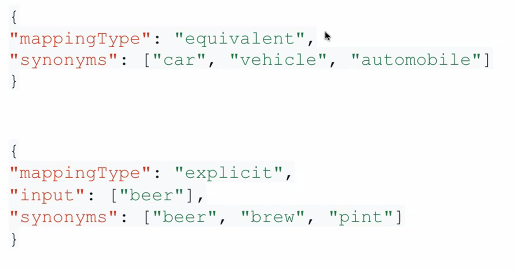

# Atlas

## Atlas search
- Define relevance-based search. Based on apache Lucene.


- Other supported features
  - Support 40* languages
  - Autocomplete
  - Highlighting
  - Fuzzy matching
  - Faceting
  - Multiple data types
    - GeoJSON, dates, ...
  - Synonyms
  
  - Scoring
  


<br>


### Creating an index 
```js
{ 
  "name": "<index-name>", // required
  "analyzer": "<analyzer-for-index>",
  "searchAnalyzer": "<analyzer-for-query>", 
  "mappings": { // required
    "dynamic": <boolean>, 
    "fields": { <field-definition> } 
  }, 
  "analyzers": [ <custom-analyzer> ],
  "storedSource": <boolean> | { <stored-source-definition> },
  "synonyms": [ <synonym>] 
}
```

- *analyzer*
    - **Standard**
        - Uses the default analyzer for all Atlas Search indexes and queries.
    - **Simple**
	    - Divides text into searchable terms wherever it finds a non-letter character.
    - **Whitespace**
	    - Divides text into searchable terms wherever it finds a whitespace character.
    - **Language**
	    - Provides a set of language-specific text analyzers.
    - **Keyword**
	    - Indexes text fields as single terms.


<br>

- *searchAnalyzer*
    - Specifies the analyzer to apply to query text before searching with it. If omitted, defaults to the analyzer that you specify for the analyzer option. If you omit both the searchAnalyzer and the analyzer options, defaults to the Standard Analyzer.

<br>

- *mappings*
    - Specifies how to index fields at different paths for this index.
    - *dynamic*
        - Enables or disables dynamic mapping of fields for this index.
        - If true, Atlas Search recursively indexes all dynamically indexable fields.
        - If false (default), you must specify individual fields to index using mappings.fields.
  - *fields*
    - Specify fields to index.
    - We can specify dynamic mapping inside fields and field types to index. Ex:
    ```js
    // this will index fields:
    //  - name of type string
    //  - pokedex_entry of type document that contains the yellow field of type string
    {
      'mappings': {
        'dynamic': false,
        'fields': {
          'name': {
            'type': 'string'
          }
          'pokedex_entry': {
            'type': 'document',
            'dynamic': false,
            'fields': {
              'yellow': {
                'type': 'string'
              }
            }
          }
        }
      }
    }
    ```

<br>

- *analyzers*
    - Specifies the custom analyzers to use in this index
```js
"analyzers": [
  {
    "name": "<name>",
    "charFilters": [ <list-of-character-filters> ],
    "tokenizer": {
      "type": "<tokenizer-type>"
    },
    "tokenFilters": [ <list-of-token-filters> ]
  }
]
```

<br>

- *storedSource*
    - Specifies fields in the documents to store for query-time look-ups using the returnedStoredSource option. You can store fields of all Data Types on Atlas Search. Value can be one of the following:
        - true, to store all fields
        - false (default), to not store any fields
        - Object that specifies the fields to include or exclude from storage

<br>

-synonyms
    - Synonym mappings to use in your index

```js
"synonyms": [
    {
        "name": "<synonym-mapping-name>",
        "source": {
            "collection": <source-collection-name>
        },
        "analyzer": <synonym-mapping-analyzer>
    }
  ] 
```


<br><br>

### Atlas Search queries

```js
{
  $search: {
    "index": "<index-name>",
    "<operator-name>": {
       <operator-specifications>
    },
    // other options...
  }
}
```

#### **Operators**

- **autocomplete**
  - Performs a search-as-you-type query from an incomplete input string
- **compound**
  - Combines other operators into a single query.
- **embeddedDocument**
  - Queries fields in embedded documents, which are documents that are elements of an array.
- **equals**
  - Works in conjunction with the boolean and objectId data types.
- **exists**
  - Tests for the presence of a specified field.
- **geoShape**
  - Queries for values with specified geo shapes.
- **geoWithin**
  - Queries for points within specified geographic shapes.
- **in**
  - Queries both single value and array of values.
- **knnBeta**
  - Performs semantic search using Hierarchical Navigable Small Worlds algorithm.
- **moreLikeThis**
  - Queries for similar documents.
- **near**
  - Queries for values near a specified number, date, or geo point.
- **phrase**
  - Searches documents for terms in an order similar to the query.
- **queryString**
  - Supports querying a combination of indexed fields and values.
- **range**
  - Queries for values within a specific numeric or date range.
- **regex**
  - Interprets the query field as a regular expression.
- **span**
  - Specifies relative positional requirements for query predicates within specified regions of a text field.
- **text**
  - Performs textual analyzed search.
- **wildcard**
  - Supports special characters in the query string that can match any character.

#### **Collectors**
Collectors return a document representing the metadata results, typically an aggregation over the matching search results.
- **facet**
  - Groups query results by values or ranges in specified, faceted fields and returns the count for each of those groups.


<br>

```js
{
  $searchMeta: {
    "index": "<index-name>",
    "<operator-name>"|"<collector-name>": {
       <operator-specifications>|<collector-specifications>
    }
    // other options ...
  }
}
```

- Autocomplete index
    - tokenization types:
        - **edgeGram** look for matches at the beginning of a word on the name field
        - **nGram** 
        - **regexCaptureGroup**


<br><br>


## Realm App Services

- Built-in GraphQL
  - autogenerate JSON schema for collections and query against a single endpoint for the data you need
- Serverless Realm functions and triggers
  - define and execute Javascript functions to build APIs and integrate with cloud services, and more
- Production-grade auth
  - Manages user authentication and integrates with providers - both internal and external
- Detailed logging
- Emmbedded cli
- SDKs for major platforms