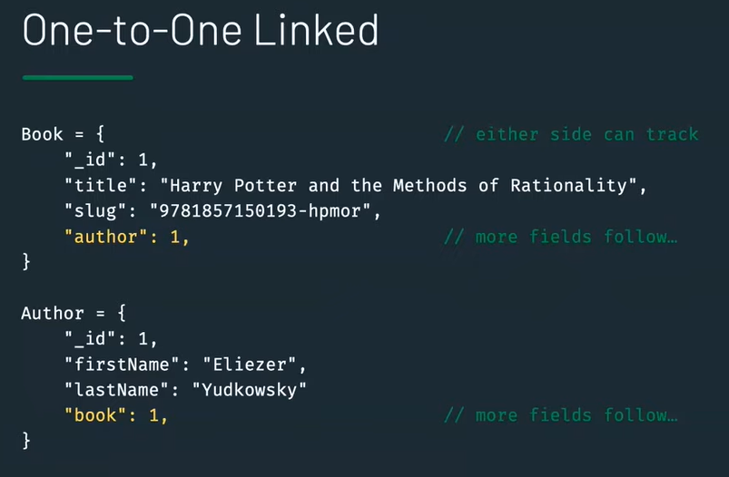
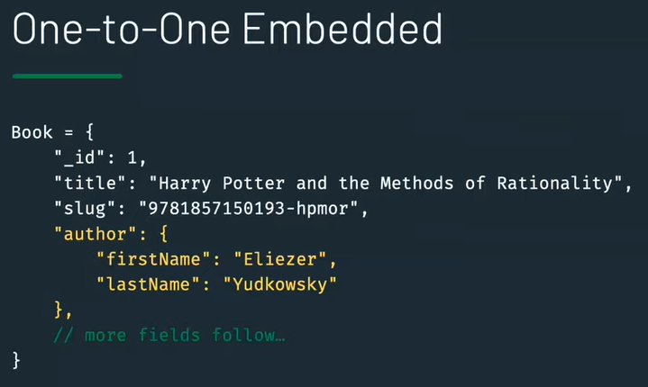
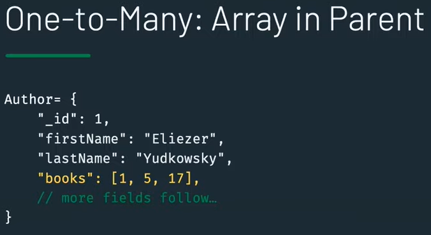
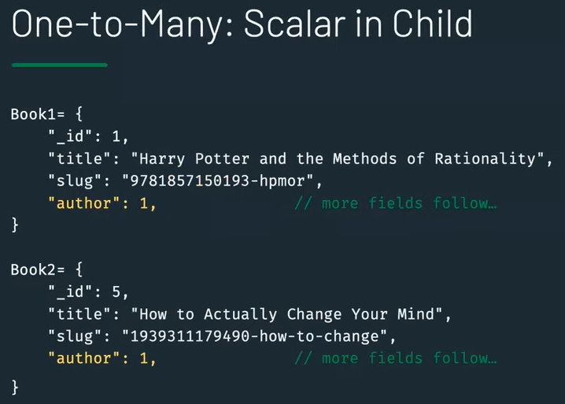
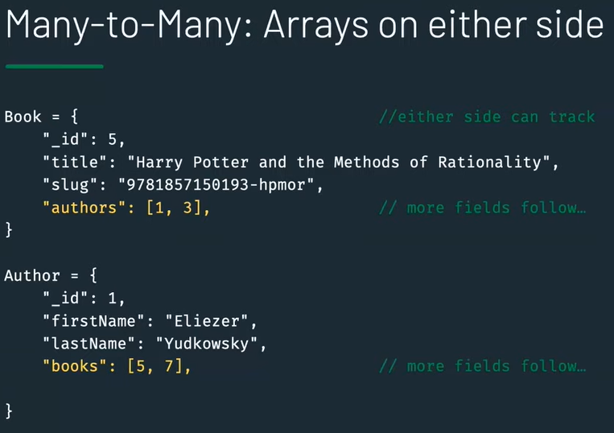
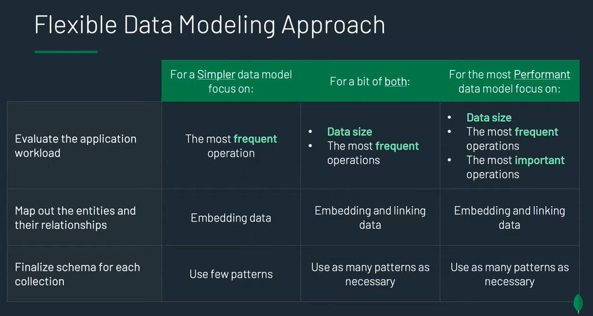

# Data modeling

Working set: The data that MongoDB uses most often.

- data model is defined at the application level
    - data model is defined by the application needs
    - application read and write operations

1. Evaluate the application workload to get:
	- data size
	- list of operations ranked by importance/usage
2. Map out entities and relationships
	- CRD (Collection Relationship diagram) to decide if the collection is linked or embedded
3. Identify and apply relevant design patterns

 

- Principles:
    - data that is accessed together should be stored together
    - avoid unbounded documents. Ex: a collection of blog posts that contains an array of comments made by people that see the blogpost; the array might grow too large, it might be better to store the comments in a separate collection

### Embedding vs referencing
- Embedding:
    - single query to retrieve data
    - single operation to update/delete data
    - !! large documents
    - !! data duplication
- Referencing
    - no duplication
    - smaller documents
    - !! might need to join data from multiple documents

 

## Linked vs Embedded
| | |
|-|-|
|||
|||
|||

- How do we decide ?
    - how often does the embedded information get accessed ?
    - is the data queried using the embedded information ?
    - does the embedded information change often ?

 

## Design patterns

### **Schema versioning pattern**
- Un pattern en el que anem canviant constanment el format dels documents.
- Per a que la nostra aplicacio pugui identificar la versio de cada document afegim un camp “schema_version”.
- Podem tenir un batch que vagi actualitzant els schemas antics.

### **Bucket pattern**
- Really benefits from the document model
- Used to store small, related data (Bank transactions, IoT readings, etc. )
- Reduces index sizes by a large magnitude
- Increases speed of retrieval of related data

Ex: IoT project where we have a smart building with lots of sensors
- Tabular approach: new document for each sensor reading
- Document approach: new document per time unit. Cada document és un interval de temps amb els reading de tots els sensor que s'han enviat en aquell interval.

### **Computed pattern**
- Never recompute what you can “precompute”
- Reads are often more common than writes
- Compute on writes is less work than compute on reads
- When updating the database, update some summary redords too
- Can be thought of as caching pattern

Ex: each document contains a film rating made by a person
- si volem trobar la mitjana de rating d'una peli hem de buscar tots els documents i calcular la mitjana.
- Seria millor tenir un array de ratings per cada pelicula amb totes les reviews, incrementar el numero de reviews cada cop que s'inserta una i tenir un sumatori de reviews i aixi nomes hauriem de trobar un document i fer el calcul de sumatori entre el numero total de reviews per trobar la mitja.

 

