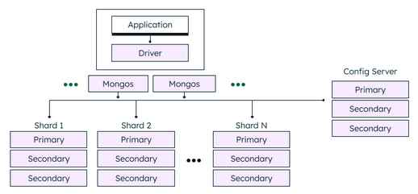
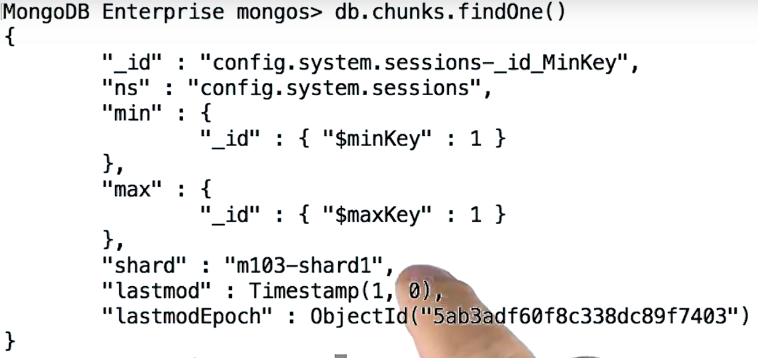
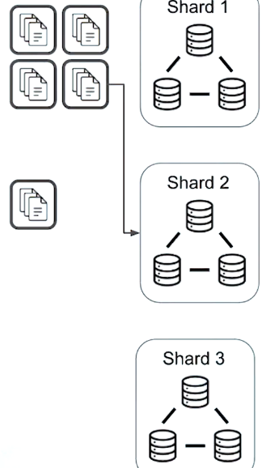
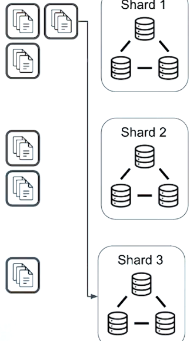
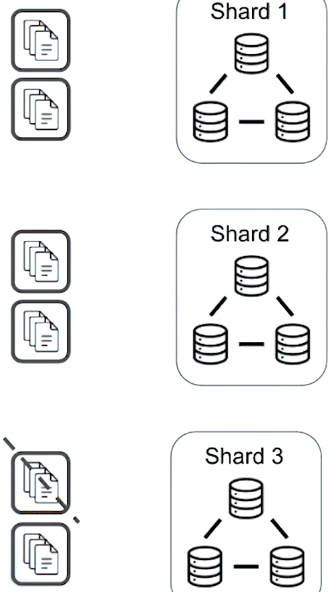

# SHARDING

- Divide our Dataset into pieces and distribute them amongst our sharded cluster.
- Config Servers store metadata about each shard
    - Make sure there is an even distribution of data between shards by moving data between them
- The mongos routes the queries to the right shard by looking up the metadata on the Config Server




<br><br>


## SHARD KEY
- Shard key is used to divide the documents into chunks (logical groupings) an distribute them across the Sharded cluster cluster

- Amb la Shard key es decideix a quina maquina es dirigeixen els reads/writes.
    - Els writes van dirigits només a una sola màquina del cluster 
    - Els reads, varien:
        - Si fem una query incloent la Shard key, aquesta es dirigirà només a la màquina que toqui
        - Si fem una query per buscar per un camp diferent al Shard Key, la querie s’executa en paral·lel a tots els Shards i el mongos s’encarrega de fer el SHARD_MERGE per a agregar els resultats i retornar-los al client.
        - Així, és important elegir una bona Shard Key per a que els nostres patrons de búsqueda habituals la utilitzin

- Shard key …
    - **field must exist in every document** in the collection.
    - are **immutable**.
        - cannot change shard key fields post-sharding
        - cannot update the values of the shard key field post-sharding
        - Starting in MongoDB 4.2, shard key field values are mutable 
    - **field must be indexed**.
    - are **permanent**.
        - cannot unshard a collection

- How to Shard
    ```js
    sh.enableSharding("<database>") 
    db.collection.createIndex()  // create the index for your shard key fields
    sh.shardCollection("<database>.<collection>", {shard key} )
    ```

<br>

### Choosing a Shard key
We have to consider:
#### **Cardinality** 
- Determines the maximum number of chunks the balancer can create.
- A shard key with high cardinality is desired. 
- Això vol dir que la key tingui un rang de valors gran. Si té un rang de valors petit (p.e. de un integer de 0 a 3), només es podrien crear 4 chunks

#### **Frequency**
- Represents how often a given shard key value occurs in the data
- És a dir, que el rang de valors que pot prendre la key estigui ben repartida entre tots els documents de manera que no estiguin tots els documents concentrats en un rang petit de valors

#### **Monotonically increasing shard keys**
- p.e. quan indexem per _id (una shard key que s’incrementa progressivament) tindrem que tots els inserts aniran a un sol shard.
- Might create an insert throughput bottleneck
- If the operations are predominately reads/updates, this limitation might not affect the cluster

#### **Query patterns**

#### **Shard key limitations**
- For Mongo4.2 and earlier, a shard key cannot exceed 512 bytes
- Shard key index cannot be an index that specifies a multikey index, a text index or a geospatial index
- Shard key selection is immutable in Mongo4.2 and earlier


<br><br>


## Chunks and the balancer

The Config Servers hold the cluster metadata. One of the most important pieces of information that it holds is the mapping from chunks to shards.



- Els chunks són trossos de la nostra sharded collection que es reparteixen entre el nostre sharded cluster
- Shard key cardinality and chunk size determines the number of chunks that are created
    - Chunk size is 64MB by default. 
    - Podem elegir un valor entre 1MB i 1024MB i el podem modificar quan volguem (during Runtime) fent: db.settings.save({_id: “chunksize”, value: 2})
- Si fem sh.status() podem veure quants chunks té cada shard

<br>

### Jumbo chunks
- Passa quan es genera algun chunk gegant degut a que les dades estan mal repartides i els valors de la shard key no estàn ben repartits.
- Cannot move jumbo chunks
    - Once marked as jumbo the balancer skips these chunks and avoids trying to move them 
- In some cases these will not be able to be split

<br>

### The balancer 
- runs on the primary member of the Config server replicaSet
- **identifies which shards have too many chunks and moves them around in order to achieve an even data distribution**
- It can automatically split chunks if needeed
- when it detects an imbalance it starts a balancer round
    - Càlcul del nombre de chunks que es poden migrar per balancer round: floor(n/2) on n=#shards
    - Ex:
        - floor(n/2) = floor(3/2) = floor(1,5) = 1 chunk/round
        - per tant, necessitarem fer dos rondes per balancejar el cluster

||||
|-|-|-|
||||
||||

- Requires minimal configuration but we can manually control it:
    ```js
    sh.startBalacer(timeout, interval)
    sh.stopBalacer(timeout, interval)
    sh.setBalancerState(boolean) 
    ```


<br><br>


### Config servers and cluster metadata
- Config servers store the metadata for a sharded cluster including…
    - the list of chunks on every shard
    - the ranges that define the chunks

- The mongos caches this data and uses it to route read/write operations to the correct shards. mongos updates the cache when there are metadata changes.

- The config servers also store Authentication configuration information such as Role-Based Access Control or internal authentication settings for the cluster	
